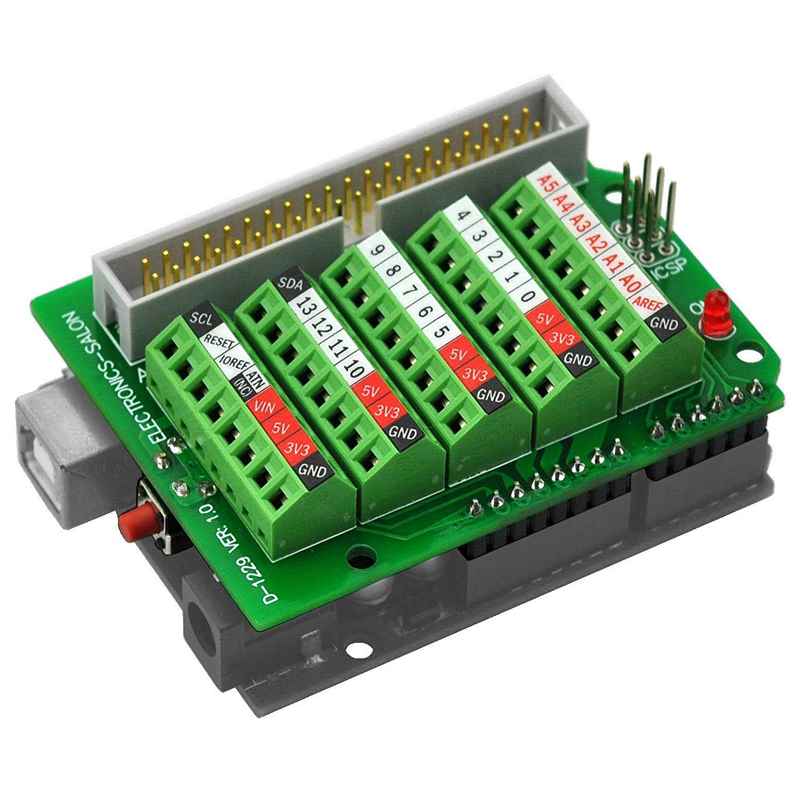
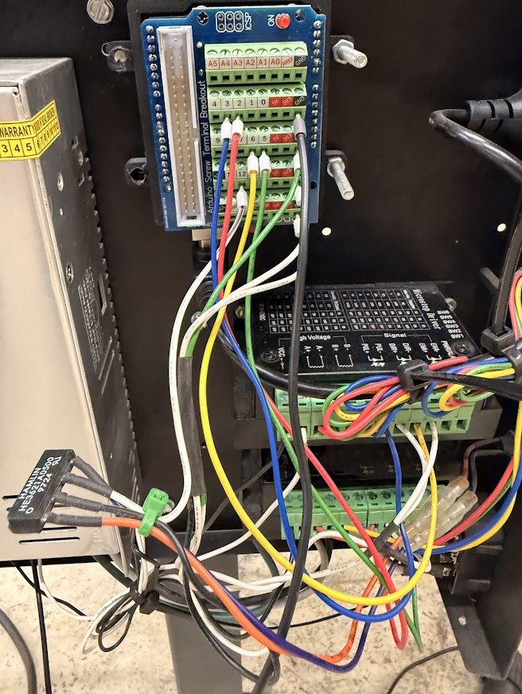

# CrossGRBL

Drop-in replacement controller for the **Langmuir Systems CrossFire** CNC plasma table. Runs on an Arduino Uno with an Electronics-Salon screw terminal shield, fully compatible with Langmuir's **FireControl** sender software.

This project replaces the stock CrossFire controller board with commodity hardware while keeping the full FireControl experience — jogging, G-code streaming, torch control, pierce delay overrides, and THC support.

The CrossFire already has external **Leadshine stepper drivers** built into the electronics enclosure — the Arduino only needs to output 5V logic-level step/direction/enable signals. No motor driver shield (gShield, CNC shield, etc.) is required.

## What You Need

| Component | Purpose | Link | Approx Cost |
|-----------|---------|------|-------------|
| Arduino Uno R3 | Motion controller (ATmega328P @ 16MHz) | [Amazon](https://www.amazon.com/dp/B0BXNVH53Y) | ~$25 |
| Electronics-Salon Screw Terminal Shield | Breakout for wiring to CrossFire drivers | [Amazon](https://www.amazon.com/dp/B07HF2DD7T) | ~$8 |
| USB Cable (Arduino to PC) | For flashing firmware and connection | Included with Arduino | - |

**Total: ~$33** (vs $200+ for a stock CrossFire replacement board)

## Screw Terminal Shield Wiring

This project uses the **Electronics-Salon D-1229** screw terminal breakout shield, which gives you easy screw-terminal access to every Arduino Uno pin without soldering. ([Amazon link](https://www.amazon.com/dp/B07HF2DD7T))



The shield plugs directly onto the Arduino Uno. All connections below refer to the **screw terminal numbers** printed on the shield.

### Motor Connections

The CrossFire is a 2-axis (X/Y) plasma table. The Leadshine stepper drivers are already in the CrossFire's electronics enclosure — you just need to connect the 5V logic signals from the Arduino to the driver inputs.

Each axis needs three wires: **STEP**, **DIR**, and **ENABLE**.

```
                LEADSHINE DRIVER (X)            LEADSHINE DRIVER (Y)
               ┌──────────────┐                ┌──────────────┐
Terminal 2 ───►│ PUL+ (Step)  │  Terminal 3 ──►│ PUL+ (Step)  │
Terminal 5 ───►│ DIR+ (Dir)   │  Terminal 6 ──►│ DIR+ (Dir)   │
Terminal 8 ───►│ ENA+ (Enable)│  Terminal 8 ──►│ ENA+ (Enable)│
GND        ───►│ PUL-/DIR-/ENA│  GND        ──►│ PUL-/DIR-/ENA│
               └──────────────┘                └──────────────┘
```

| Screw Terminal | Arduino Pin | GRBL Function | Wire To |
|:--------------:|:-----------:|---------------|---------|
| **2** | D2 | X Step | X Leadshine driver PUL+ |
| **3** | D3 | Y Step | Y Leadshine driver PUL+ |
| **5** | D5 | X Direction | X Leadshine driver DIR+ |
| **6** | D6 | Y Direction | Y Leadshine driver DIR+ |
| **8** | D8 | Stepper Enable | Both drivers ENA+ (active low) |
| **GND** | GND | Ground | Both drivers PUL-/DIR-/ENA- |

> **Note:** Terminal 8 (Enable) is shared — run a wire from terminal 8 to both the X and Y driver enable inputs. The enable signal is active-low: LOW = motors engaged, HIGH = motors released.

### Wiring Diagram



*Completed wiring showing Arduino Uno with screw terminal shield connected to CrossFire Leadshine drivers*

### Torch Fire (Plasma Trigger)

The torch fire signal uses the **spindle enable** pin. When FireControl sends M3 (spindle on), this pin goes HIGH to trigger the plasma cutter. The CrossFire's electronics enclosure already has a MOSFET/transistor circuit for torch triggering — connect pin 12 to the torch trigger input on the CrossFire's wiring harness.

| Screw Terminal | Arduino Pin | Function | Wire To |
|:--------------:|:-----------:|----------|---------|
| **12** | D12 | Torch Fire | CrossFire torch trigger input |
| **GND** | GND | Ground | CrossFire trigger ground |

### Limit Switches (Optional)

| Screw Terminal | Arduino Pin | Function |
|:--------------:|:-----------:|----------|
| **9** | D9 | X Limit |
| **10** | D10 | Y Limit |
| **11** | D11 | Z Limit |

### Control Pins (Optional)

| Screw Terminal | Arduino Pin | Function |
|:--------------:|:-----------:|----------|
| **A0** | A0 | Reset |
| **A1** | A1 | Feed Hold |
| **A2** | A2 | Probe |
| **A5** | A5 | THC Enable Signal |

### Complete Wiring Summary

```
ELECTRONICS-SALON SCREW TERMINAL SHIELD
┌──────────────────────────────────────────────────────────┐
│                                                          │
│  Terminal 2  ── X STEP ──────► X Leadshine PUL+          │
│  Terminal 3  ── Y STEP ──────► Y Leadshine PUL+          │
│  Terminal 5  ── X DIR  ──────► X Leadshine DIR+          │
│  Terminal 6  ── Y DIR  ──────► Y Leadshine DIR+          │
│  Terminal 8  ── ENABLE ──┬───► X Leadshine ENA+          │
│                          └───► Y Leadshine ENA+          │
│  Terminal 12 ── TORCH  ──────► CrossFire torch trigger   │
│  Terminal A5 ── THC    ──────► THC Module (optional)     │
│  GND         ────────────┬───► Leadshine PUL-/DIR-/ENA-  │
│                          └───► CrossFire trigger ground   │
│                                                          │
└──────────────────────────────────────────────────────────┘
```

## Flashing Guide

There are two things to flash:
1. **USB firmware** on the Uno's ATmega16U2 chip (one-time, makes FireControl recognize the device)
2. **GRBL firmware** on the Uno's main ATmega328P chip (the actual motion controller)

### Step 1: Flash USB VID/PID (One-Time)

FireControl checks the USB Vendor ID and Product ID before it will connect. A stock Arduino Uno identifies as VID `2341` PID `0043` — FireControl ignores this. You need to reprogram the Uno's **ATmega16U2 USB interface chip** to report as a Langmuir CrossFire device:

- **Target VID:** `16D0`
- **Target PID:** `0EFB`
- **Device Name:** "Langmuir Systems CrossFire"

#### Which USB Chip Do You Have?

Different Arduino Uno revisions use different USB interface chips. This matters for flashing:

| Arduino Version | USB Chip | DFU USB PID | Hex File |
|-----------------|----------|-------------|----------|
| Uno R2 (and earlier) | AT90USB82 | `03EB:2FF7` | `CrossFire-spoof-8u2.hex` |
| Uno R3 | ATmega16U2 | `03EB:2FEF` | `CrossFire-spoof-16u2.hex` |
| Uno R3 (some clones) | ATmega8U2 | `03EB:2FEE` | `CrossFire-spoof-16u2.hex` |
| Chinese clones | CH340G | N/A | **Cannot use DFU method** |

> **Important:** If your Arduino uses a CH340 USB chip (common on cheap clones), this method won't work. You need an Uno with an Atmel USB chip (ATmega16U2 or AT90USB82).

#### Entering DFU Mode

The ATmega16U2 is the small chip near the USB port on the Arduino Uno. To reprogram it, you need to put it into DFU (Device Firmware Update) mode:

1. **Plug the Arduino into USB** — it should be connected to your computer.

2. **Locate the ICSP2 header** — This is the 6-pin header closest to the USB port (not the one near the power jack).

3. **Briefly short RESET to GND** — Using a jumper wire or tweezers, momentarily connect the RESET pin to the GND pin on the ICSP2 header:
   ```
   ICSP2 Header (near USB port):
   ┌───────────┐
   │ MISO  VCC │
   │ SCK  MOSI │
   │ RST   GND │  ◄── Short these two briefly
   └───────────┘
   ```

4. **Verify DFU mode** — The Arduino's COM port will disappear from Device Manager. Windows will detect a new USB device with Atmel's DFU VID (`03EB`). The PID tells you which chip you have (see table above).

#### Installing the USB Driver (Windows)

Windows doesn't have a built-in driver for the Atmel DFU device. You need **Zadig** to install one:

1. Download [Zadig](https://zadig.akeo.ie/)
2. Run Zadig, go to **Options > List All Devices**
3. Select **"Arduino Uno DFU"** (or similar — look for VID `03EB`)
4. Note the USB ID to identify your chip variant
5. Select **libusb-win32** as the target driver
6. Click **Install Driver** (or **Replace Driver**)

#### Installing dfu-programmer

Download [dfu-programmer](https://github.com/dfu-programmer/dfu-programmer/releases) and extract it. On Windows, you'll have `dfu-programmer.exe` and `libusb-1.0.dll`.

On Linux/Mac:
```bash
sudo apt install dfu-programmer    # Debian/Ubuntu
brew install dfu-programmer         # macOS
```

#### Flashing the USB Firmware

**For ATmega16U2 (Uno R3):**

```bash
# Step 1: Erase the chip
dfu-programmer atmega16u2 erase

# Step 2: Flash the spoofed firmware (preserves DFU bootloader)
dfu-programmer atmega16u2 flash --suppress-bootloader-mem firmware/CrossFire-spoof-16u2.hex

# Step 3: Exit DFU mode and run new firmware
dfu-programmer atmega16u2 launch
```

**For AT90USB82 (Uno R2):**

```bash
dfu-programmer at90usb82 erase
dfu-programmer at90usb82 flash --suppress-bootloader-mem firmware/CrossFire-spoof-8u2.hex
dfu-programmer at90usb82 launch
```

> **Note:** The `--suppress-bootloader-mem` flag is important — it prevents overwriting the DFU bootloader itself, so you can reflash again in the future.

> **Not sure which chip?** Try each target until one connects:
> ```bash
> dfu-programmer at90usb82 get      # Uno R2 (PID 2FF7)
> dfu-programmer atmega16u2 get     # Uno R3 (PID 2FEF)
> dfu-programmer atmega8u2 get      # Some boards (PID 2FEE)
> ```

#### Alternative: Flashing via AVR ISP Programmer

If you have an AVR ISP MK2 or similar programmer, you can flash the USB chip directly via the ICSP2 header without using DFU mode:

```bash
# Backup existing firmware first
avrdude -p atmega16u2 -c avrispmkii -P usb -B 10 \
    -U flash:r:usb-chip-backup.hex:i

# Flash spoofed firmware
avrdude -p atmega16u2 -c avrispmkii -P usb -B 10 \
    -U flash:w:firmware/CrossFire-spoof-16u2.hex:i
```

#### Verify

Unplug and replug the Arduino. It should now appear as:
- **Windows Device Manager:** "Langmuir Systems CrossFire" on a new COM port
- **Linux:** `lsusb` shows `16d0:0efb`
- **Arduino CLI:** `arduino-cli board list` shows the new VID/PID

> **Reverting:** To restore the original Arduino USB firmware, enter DFU mode again and flash the stock firmware from the Arduino IDE install directory (`hardware/arduino/avr/firmwares/atmegaxxu2/`).

### Step 2: Flash GRBL Firmware

#### Option A: Using Pre-Built Hex File (Easiest)

```bash
# Using arduino-cli (download from https://arduino.github.io/arduino-cli/)
arduino-cli upload -p COMxx --fqbn arduino:avr:uno --input-file firmware/grbl-ls-1.3ls.hex
```

Replace `COMxx` with your actual COM port (check Device Manager).

#### Option B: Using avrdude Directly

```bash
avrdude -c arduino -p atmega328p -P COMxx -b 115200 -U flash:w:firmware/grbl-ls-1.3ls.hex:i
```

#### Option C: Build From Source

Requires `avr-gcc` toolchain installed.

```bash
# Build
make

# Flash (uses avrisp2 programmer by default)
make flash

# Or specify Arduino bootloader programmer:
make flash PROGRAMMER="-c arduino -P COMxx -b 115200"
```

### Step 3: Verify in FireControl

1. Open FireControl
2. It should detect **"CrossFire Gen 2"** on the COM port
3. Status bar shows connection and version **1.3ls**

### Step 4: Load Firmware Defaults (IMPORTANT!)

**GRBL stores settings in EEPROM which persists across firmware updates.** After flashing, you must reset to load the new firmware defaults:

**In FireControl Console/Terminal, send:**
```
$RST=$
```

Then **power cycle** the Arduino (unplug/replug USB).

**Or manually set the key values:**
```
$100=503.936  (X steps/mm for 8TPI)
$101=503.936  (Y steps/mm for 8TPI)
$3=3          (Invert X and Y for Mach3 wiring)
```

**Verify settings loaded:**
```
$$
```
Check that `$100` and `$101` show the correct steps/mm for your lead screws.

4. Try jogging — if the motors move in the correct direction and distance, you're done
5. If an axis moves backwards, flip the DIR wires on that stepper driver (or change `$3` direction invert mask)

## Firmware Versions

**IMPORTANT:** There are two firmware versions available depending on your CrossFire model and wiring:

### Standard Firmware (crossgrbl-standard-vX.X.X.hex)
- For newer CrossFire models with standard Langmuir wiring
- No axis direction inversion (`$3=0`)
- Use if your axes move correctly with the official Langmuir firmware

### Inverted Firmware (crossgrbl-inverted-vX.X.X.hex) - **RECOMMENDED FOR MACH3 CONVERSIONS**
- For original Mach3-based CrossFire tables converted to grbl
- Inverts both X and Y axis directions (`$3=3`)
- Use if BOTH axes move backwards with standard firmware

**How to tell which version you need:**
1. Flash the **standard** firmware first
2. Test axis movement in FireControl:
   - Press +X → should move RIGHT
   - Press -X → should move LEFT
   - Press +Y → should move AWAY (back)
   - Press -Y → should move TOWARD you (front)
3. If BOTH X and Y move in the wrong direction, use the **inverted** firmware
4. If only ONE axis is wrong, check your wiring or use `$3` settings to invert individual axes

**Note:** The original CrossFire tables that shipped with Mach3 control software typically require the inverted firmware due to different motor driver wiring conventions.

## GRBL Settings (CrossFire Defaults)

These are baked into the firmware but can be changed at runtime via serial commands (`$x=value`):

| Setting | Value | Description |
|---------|-------|-------------|
| `$0` | 10 | Step pulse time (microseconds) |
| `$1` | 255 | Step idle delay (255 = always on) |
| `$100` | 125.984 | X steps/mm |
| `$101` | 125.984 | Y steps/mm |
| `$102` | 266.666 | Z steps/mm |
| `$110` | 7620 | X max rate (mm/min) |
| `$111` | 7620 | Y max rate (mm/min) |
| `$112` | 3810 | Z max rate (mm/min) |
| `$120` | 980 | X acceleration (mm/sec^2) |
| `$121` | 980 | Y acceleration (mm/sec^2) |
| `$122` | 980 | Z acceleration (mm/sec^2) |

## THC (Torch Height Controller) — Optional

> **⚠️ WARNING: UNTESTED FUNCTIONALITY**
> The THC (Torch Height Controller) firmware and integration has **NOT been tested** with actual hardware. This feature is included from the original grbl-ls codebase but remains unverified in this implementation. Use at your own risk and please report results if you test it.

The `thc-firmware/` directory contains firmware for a separate Arduino Nano that acts as a Torch Height Controller, replacing the $750 Langmuir LS-THC module with a ~$15 DIY solution.

Arduino Nano clones with CH340 USB chips have VID `1A86` PID `7523`, which matches the Langmuir LS-THC — **no USB spoofing needed**.

See [thc-firmware/README.md](thc-firmware/README.md) for full wiring and setup instructions.

## FireControl Protocol Reference

### Pierce Delay Override Commands

| Byte | Command | Description |
|------|---------|-------------|
| `0xA2` | DWELL_50 | Pierce delay 50% |
| `0xA3` | DWELL_100 | Pierce delay 100% |
| `0xA4` | DWELL_150 | Pierce delay 150% |
| `0xA5` | DWELL_200 | Pierce delay 200% |
| `0xA6` | DWELL_0 | Pierce delay 0% (skip) |
| `0xA9` | CANCEL_WAIT | Cancel current dwell immediately |

### Key Integration Points

- **Startup banner:** `Grbl 1.3ls` (FireControl checks this)
- **Baud rate:** 115200
- **Status reports:** `<Idle|MPos:0.000,0.000,0.000|...|Ov:100,100,100,100>` (4 override values — the 4th is the dwell override)
- **Torch control:** M3 = torch on, M5 = torch off (mapped to spindle enable)
- **Jogging:** `$J=G91 X10 F1000` style commands

## Directory Structure

```
crossgrbl/
├── grbl/                  # GRBL source code (ATmega328P)
│   ├── config.h           # Compile-time config (CrossFire defaults)
│   ├── cpu_map.h          # Pin assignments
│   ├── defaults.h         # Machine defaults (steps/mm, speeds, etc.)
│   └── ...                # Core GRBL source files
├── thc-firmware/          # THC controller firmware (Arduino Nano)
├── firmware/              # Pre-built hex files
│   ├── grbl-ls-1.3ls.hex              # Ready-to-flash GRBL firmware
│   ├── CrossFire-spoof-16u2.hex       # USB spoof for Uno R3 (ATmega16U2)
│   ├── CrossFire-spoof-8u2.hex        # USB spoof for Uno R2 (AT90USB82)
│   ├── THC-spoof-8u2.hex             # USB spoof for THC (if needed)
│   └── CrossFire-Gen2-v1.3ls-official.hex  # Stock Langmuir firmware (reference)
├── docs/images/           # Documentation images
├── Makefile               # Build/flash GRBL from source
├── COPYING                # GPLv3 License
└── README.md
```

## Troubleshooting

### FireControl won't detect the board
- Verify USB VID/PID was flashed correctly: check Device Manager for "Langmuir Systems CrossFire"
- If it still shows as "Arduino Uno", the USB firmware flash didn't take — retry DFU mode
- Make sure you're using the correct hex file (16u2 vs 8u2)
- CH340-based Arduino clones cannot be spoofed — you need a genuine Uno or one with an ATmega16U2/AT90USB82

### Motors don't move
- Check terminal 8 (Enable) is wired to both Leadshine drivers — it must be LOW to enable
- Verify STEP and DIR wires are on the correct terminals (2/5 for X, 3/6 for Y)
- Check your Leadshine driver power supply is on
- Verify the Leadshine drivers are configured for the correct microstepping

### Axis moves in wrong direction
- Swap the DIR wire polarity on the Leadshine driver, OR
- Change the direction invert mask: `$3=1` (invert X), `$3=2` (invert Y), `$3=3` (invert both)

### Torch won't fire
- Check terminal 12 is wired to the CrossFire torch trigger input
- Test manually: send `M3` via serial terminal, pin 12 should go HIGH
- Verify continuity from terminal 12 to the CrossFire trigger circuit

### Version mismatch warning in FireControl
- Ensure GRBL reports `1.3ls` — connect via serial at 115200 baud and check startup banner
- If you built from source, verify `GRBL_VERSION` in `grbl/grbl.h` is `"1.3ls"`

## License

GRBL firmware is licensed under the **GNU General Public License v3.0** — see [COPYING](COPYING).

THC firmware is licensed under the **MIT License**.

## Credits

- [GRBL](https://github.com/gnea/grbl) by Sungeun K. Jeon / Gnea Research LLC
- [grbl-ls](https://github.com/langmuirsystems/grbl-ls) by Langmuir Systems
- [Electronics-Salon](https://www.electronics-salon.com/) for the screw terminal shield
